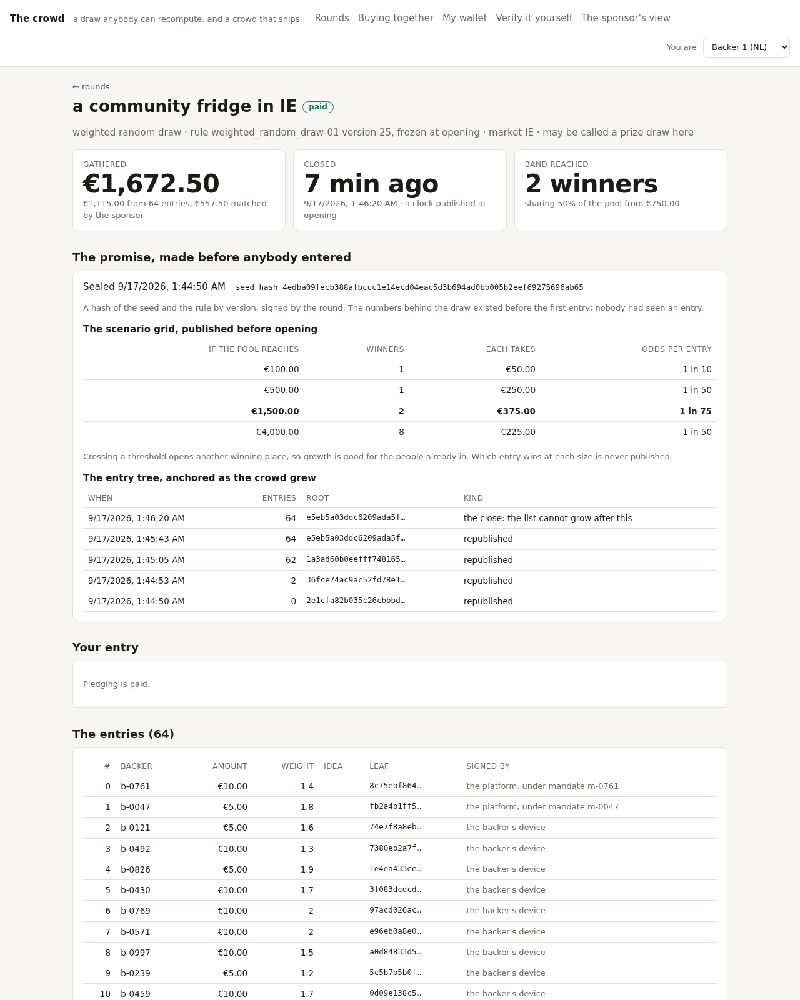
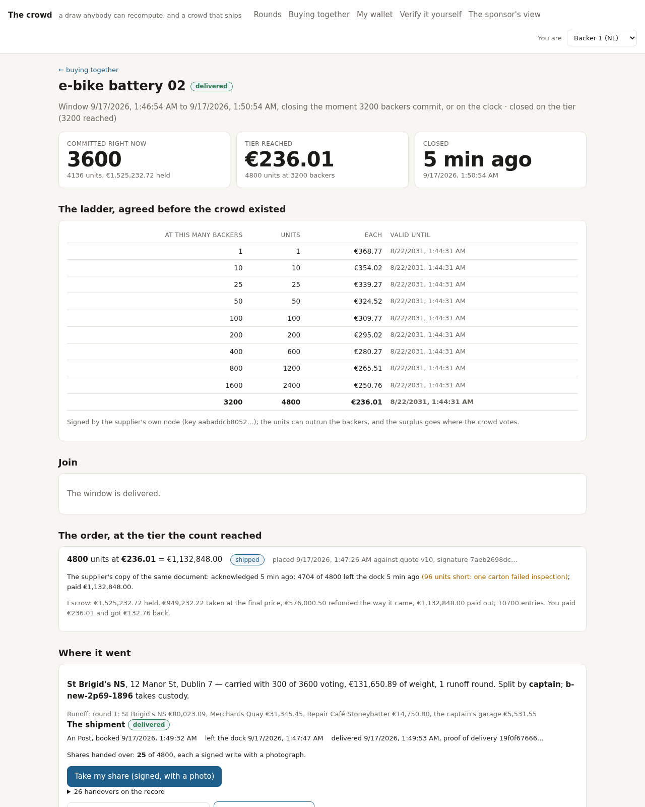

# Gamified crowdfunding: the MVP, built from the kit

A draw anybody can recompute, and a crowd that ships. Forty allocation
mechanisms as documents rather than code, including the gamified one: a
weighted random draw that seals a hash of its seed before pledging opens
and publishes everything needed to rerun it afterwards. Then the crowd
buys together on an additive counter four thousand people write to in the
same minute, and votes on where the pallet is actually delivered. This
repository is that design built as a demo on one machine, by Claude Code,
from the build kit the Unidatum Design studio produced for it, plus the
backer web app. The design is in the post:

- [Architecture: gamified crowdfunding, where anybody can recompute the draw](https://www.unidatum.ie/en/blog/architecture-gamified-crowdfunding)

**Run it:** `bin/demo-up.sh`. It fetches the engine's release archive
from the OptimalMatch/peer-to-peer-db releases (never into git), builds
the image, brings up four nodes on three libraries, seeds twenty stores,
starts the watchers, the simulators and the web app, sets up Metabase,
runs the three processes and the twenty-seven checks. About ten minutes.
Then open **http://127.0.0.1:18180**. `DEMO.md` walks the three processes
step by step.

| file | what it is |
| --- | --- |
| `DECISIONS.md` | the answers to the kit's open questions, and why |
| `DEMO.md` | the demo script: each process step by step, what to run, where to look |
| `GAPS.md` | where the design and the engine differ, and what was done about it |
| `Dockerfile`, `entrypoint.sh`, `docker-compose.yml` | the engine image, one container per design node (one engine process per library), the SQL wire, Metabase, MinIO, the watchers, the simulators, the web app |
| `lib/` | the engine's HTTP API (`api.mjs`), hashing, the entry tree and the sealed commitment (`hash.mjs`), device signatures (`crypto.mjs`), the six allocation families (`mechanisms.mjs`), the two checks of "Verify it yourself" (`verify.mjs`), the drand beacon, the S3 client, the markets |
| `seed/seed.mjs` | twenty stores at the sheet's scale; every history round a real one with a proof that recomputes |
| `sims/` | the round, the buy and the vote as watchers; the escrow; the supplier's and the sponsor's nodes; the backer app's calls; the verifier; the round agent over MCP |
| `web/` | the backer app and web: the browser app and its server |
| `bin/` | `demo-up.sh`, `fetch-engine.sh`, `declare-stores.sh`, `metabase.mjs`, `archive.mjs`, `bench-joins.mjs` |
| `checks/run.mjs` | the twenty-seven checks of the MVP sheet |

The kit as delivered is the first commit, and its files are unchanged
below: the contract this was built to.

## Results

From the last run, a fleet built from nothing by `bin/demo-up.sh`
(2026-09-17): one live round, one live buy with 3,600 joins, one vote, and
twenty-seven checks passing (`checks/run.mjs`).

| what the sheet asked | measured |
| --- | --- |
| a round opened, sealed before any entry, closed on its clock, drawn, paid | opened → sealed 1.3 s; sealed → closed 90.2 s (the published window); closed → proof 10.4 s (the drand round after the close); proof → paid 5.9 s |
| entries, weighted, with a path to the root each | 64 entries: 60 from devices, 4 raised by standing contributions on their paydays; €1,115.00 gathered, €557.50 matched by the sponsor |
| every draw recomputes to the same answer | 201 of 201 hot-tier proofs recompute from the regulator's own copy, 100 in 100; 800 cold rounds hold their entries in the bucket |
| four thousand join in the same minute, onto the additive counter | 3,600 joined in 25 s (137 a second, 200 phones in flight) before the window closed on its tier; the counter read 3,600, the receipts 3,600, every one signed |
| the order at the tier reached, against the published quote | 4,800 units at €236.01 (tier 3,200), citing the supplier's signed row; the supplier's node acknowledged and shipped on the same document |
| take what was held, refund the difference | €1,525,232.72 held, €949,232.22 taken, €576,000.50 refunded the way it came, €1,132,848.00 paid to the supplier; window → ordered 32 s, ordered → paid 3 s; 10,700 ledger entries, all signed |
| the crowd decides where, ranked and weighted | 300 of 3,600 ranked (quorum 5%), €131,650.89 of weight, one runoff round; carried: a school, split by a captain from the buy |
| the pallet lands, shares change hands | delivered 3.0 min after the window opened; 25 shares handed over, each a signed write with a photograph |

The other pages are in `docs/results/`: the rounds a market may see,
the windows, a backer's wallet and statement rendered from the ledger,
Verify it yourself, and what the sponsor sees.

---

# Gamified crowdfunding: a draw anybody can recompute, and a crowd that ships: build kit

This folder is everything Claude Code needs to build a demo of this design on one machine.

1. Put the Unidatum release archive in this folder: `unidatum-<version>-linux-amd64.tar.gz` (or the zip), from your evaluation licence at https://www.unidatum.ie/en/pricing#evaluation.
2. Open this folder in Claude Code.
3. Say: **build it**.

Claude Code reads `CLAUDE.md`, asks the open questions once, and builds the MVP sheet section by section, one commit per section, with the checks as the tests and the demo script as the README of the repo it makes.

| File | What it is |
| --- | --- |
| `CLAUDE.md` | The prompt for the MVP on one machine with docker-compose |
| `CLAUDE-FULL.md` | The prompt for the real deployment, for later |
| `design.json` | The design, every level and the process view; open it in the studio at https://www.unidatum.ie/en/architect with Load JSON |
| `BUILD-SHEET.md` | The runbook for the real deployment |
| `MVP-SHEET.md` | The same design on one machine: services, scale, seed data, the demo script, the checks |
| `docker-compose.yml` | The draft from the MVP sheet, to edit |
| `checks/` | One stub per check in the MVP sheet |

Made by the Unidatum Design studio. Unidatum Integrated Products Limited, Ireland.
